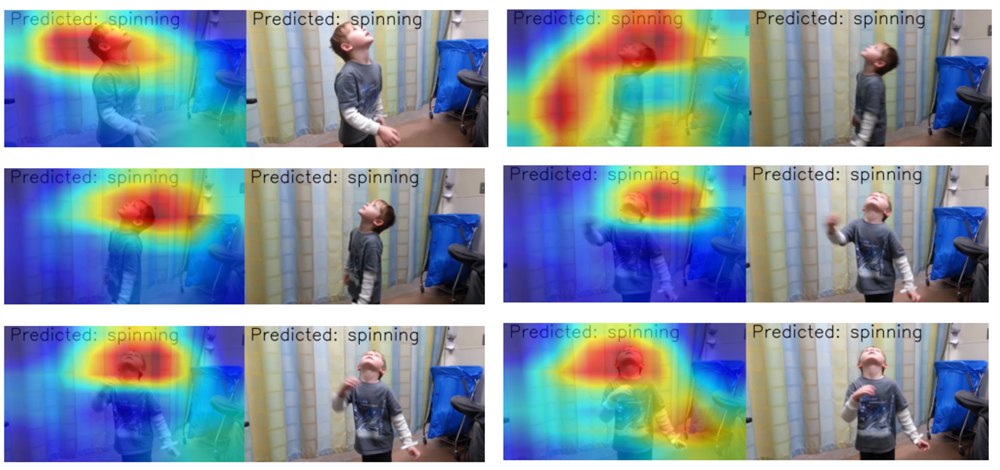
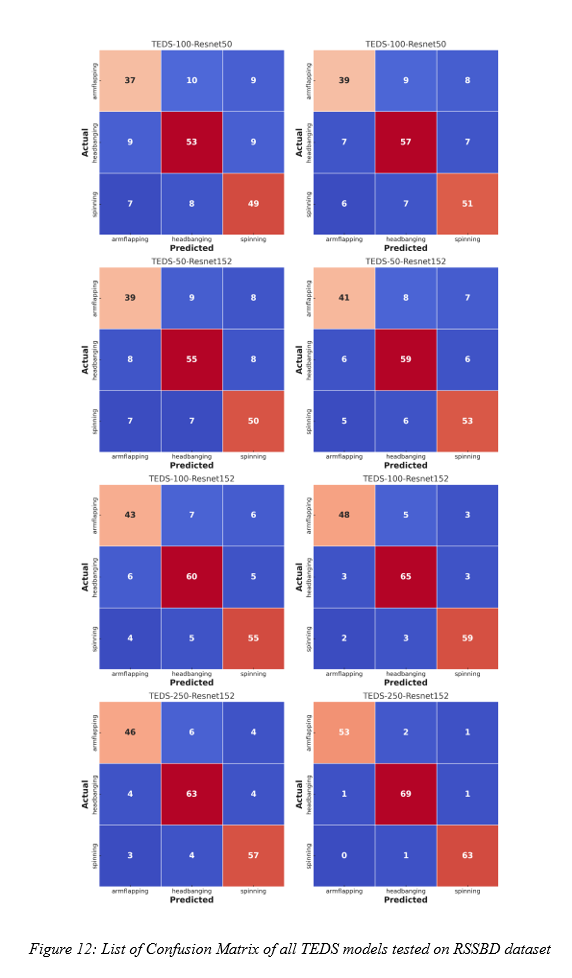

# TSTE - Two Stream Late/Early Fusion Transformer-based Activity Recognition

This repository contains the codebase for an advanced video analysis pipeline that integrates multiple state-of-the-art models and methodologies, including YOLO V8, ByteTrack, Movenet, and Transformer encoders for high-accuracy activity recognition. The pipeline is trained on the Actitracker dataset provided by the WISDM Lab.

## Project Overview

The primary goal of this project is to experiment with different fusion strategies in activity recognition using transformer-based models. It aims to explore how early and late fusion of spatial and temporal features affects model accuracy, efficiency, and robustness when applied to activity recognition tasks. The project seeks to advance current methodologies by integrating multiple attention-based architectures with skeleton-based representations.

## Project Pipeline

Below is a detailed description of each step in the pipeline:

### **1. Preprocessing Steps**

Before feature extraction, raw video frames undergo a series of preprocessing steps:

- **Frame Extraction:** Individual frames are extracted from video input at different frame rates.
- **Region of Interest (ROI) Extraction:** YOLO V8 is used to detect the subject in the first frame, followed by tracking using ByteTrack or DeepSort.
- **Pose Estimation:** Movenet is used to extract skeletal pose information.
- **Heatmap Generation:** The extracted skeletal poses are converted into joint-limb skeleton heatmaps.

**Preprocessing Visualization:**  


### **2. Feature Engineering**

Feature extraction is performed using a two-stream approach:

#### **Spatial Feature Extraction Stream**

- **Input:** ROI images extracted from the video frames.
- **Action:** Features are extracted using ResNet/I3D followed by a Transformer encoder with lower self-attention (due to lower frame rate processing).
- **Output:** Spatial feature embeddings.

#### **Temporal Feature Extraction Stream**

- **Input:** Joint-limb skeleton heatmaps derived from pose estimation.
- **Action:** A Transformer encoder with a higher level of self-attention (due to higher frame rate processing) extracts temporal patterns.
- **Output:** Temporal feature embeddings.

### **3. Fusion Strategies**

Two fusion techniques are implemented in the model:

#### **Early Fusion Approach**

- **Fusion Step:** Spatial and temporal features are combined before the classification stage.
- **Classification:** A single softmax classifier predicts the activity class based on the fused feature representation.

**Early Fusion Model Architecture:**  


#### **Late Fusion Approach**

- **Fusion Step:** Spatial and temporal features are encoded separately and classified independently before final fusion.
- **Classification:** Two separate softmax layers generate predictions, which are combined to make a final decision.

**Late Fusion Model Architecture:**  


### **4. Classification Model**

The final step in the pipeline is classification, where the model predicts the activity class using the extracted features.

- **Input:** Fused feature representations (from either early or late fusion techniques).
- **Action:** Classification is performed using a softmax layer.
- **Output:** Predicted activity class (e.g., Arm-Flapping, Head Banging, Jumping, etc.).

### **5. Attention-Based Analysis**

To interpret the model's decision-making process, we visualize attention maps over input frames:

**Attention Map Visualization:**  


### **6. Model Performance Evaluation**

The model is evaluated using confusion matrices to analyze the effectiveness of different model configurations on the RSSBD dataset.

**Confusion Matrices for Different Model Configurations:**  


### **7. Model Performance Table**

The following table presents the performance metrics of different TEDS models on the RSSBD dataset:

| Method                | Parameters | Spatial Attention Head | Temporal Attention Head | Weighted F1 Score (%) |
|-----------------------|------------|------------------------|------------------------|------------------------|
| TEDS-100-Resnet50    | 23M        | 4                      | 4                      | 72.95                  |
| TEDS-100-Resnet50    | 31M        | 4                      | 8                      | 77.06                  |
| TEDS-50-Resnet152    | 58M        | 4                      | 4                      | 75.33                  |
| TEDS-50-Resnet152    | 82M        | 4                      | 8                      | 80.33                  |
| TEDS-100-Resnet152   | 97M        | 8                      | 8                      | 82.71                  |
| TEDS-100-Resnet152   | 121M       | 4                      | 16                     | 90.21                  |
| TEDS-250-Resnet152   | 150M       | 8                      | 8                      | 86.73                  |
| TEDS-250-Resnet152   | 202M       | 4                      | 16                     | 96.86                  |

### **8. Dataset**

- The model is trained on the **Actitracker dataset** from WISDM Lab, which consists of annotated activity recognition data.

## **Installation & Usage**

1. Install dependencies:

```bash
pip install -r requirements.txt
```

2. Run the pipeline:

```bash
jupyter notebook
//Run the ActivityRecognition.ipynb file in the popup window
```

## **Conclusion**

This project presents an advanced activity recognition framework that utilizes both spatial and temporal features from video data. By integrating YOLO, Movenet, and Transformer-based encoders, the model achieves high accuracy in classifying human activities. Both early and late fusion strategies have been explored to enhance performance based on specific application needs.

